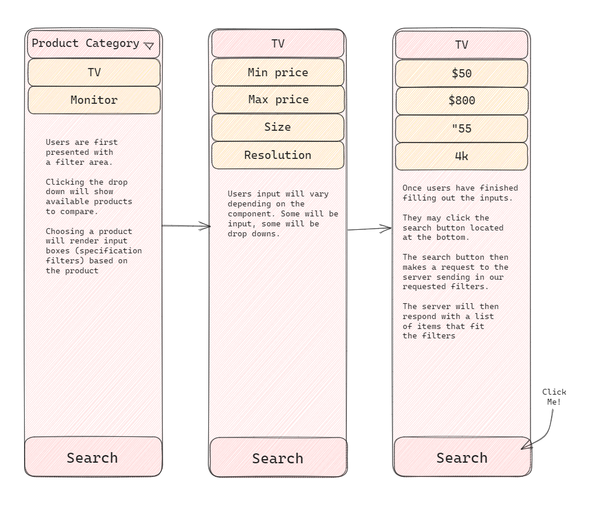

# DealDex

## Table of Contents
1. [DealDex](#dealdex)
2. [Features](#features)
3. [Installation](#installation)
4. [Scripts](#scripts)
5. [Diagrams](#diagrams)
6. [Future Goals](#future-goals)
7. [Meet the Team](#meet-the-team)


##  Features
DealDex is a product lookup tool that can be used to compare similar products from different storefronts

1. **Webscraping and APIs**: DealDex intends to implement a mixture of webscrapers and free APIs to get relevent data from online storefronts.
2. **Intuitive User Interface**: DealDex is built with the user in mind! An intuitive search/filter box responds to user clicks and displays the filtered results.
3. **Acorn**: because who doesn't love a good 'ol acorn.

## Installation
1. Ensure that you have the required prerequisites installed:
  - [npm](https://www.npmjs.com/)
2. Fork the DealDex repository on your own GitHub account. 
3. Clone your forked repository to your local machine.
```bash
git clone https://github.com/<your-github-username>/DealDex.git
```
4. Navigate to the root project directory and install dependencies
```bash
cd DealDex
npm install
```
5. Build the application in the client directory
```bash
npm run build
```
6. Run both the local server and development server
```bash
npm run startBoth
```

## Scripts
  - `start`: Starts the development server using Webpack
  - `npm run server`: Starts a local server to preview the production build.
  - `npm run build`: Runs Webpack in production mode to build your application for production.
  - `npm run startBoth`: Starts a local server and the development server concurrently to test client-side requests to the server

## Diagrams

  
  

## Future Goals
  - **Webscrapers and APIs**: We did not get around to configuring any webscrapers and there weren't any free offical APIs available from the storefronts we checked.
  - **More SQL Table Coverage**: In our quest to present an MVP, we haphazardly combined SQL tables. In the future, we'd like if our SQL tables were properly modularized and linked via keys.
  - **Serverside Routing and Middleware**: We would like to have more specific queries to our database so that we can get exactly what we need in the frontend. This way, we can both modularize our backend and have a clean and readable frontend!
  - **Frontend Functionality**: Currently, our react app is built with react hooks. Because we are lacking in some middleware, we decided to scrap the functionality and build out a solid foundation aiming for modularity. 
  - **Authorization and the Navigation Bar**: Currently we have the login/signup skeleton created. We would like to add this feature to our navbar with some added funcionality such as search history and favorites.

## Meet the Team

<table style="width:40%;">
  <tr>
    <td>
      
    </td>
    <td>
      <strong>Chang Moon</strong><br/>
      <a href="https://github.com/ThickCorgi">GitHub</a><br/>
      <a href="https://www.linkedin.com/in/chang-moon-6b2b91278/">LinkedIn</a>
    </td>
  </tr>
  <tr>
    <td>
      
    </td>
    <td>
      <strong>Cortland Young</strong><br/>
      <a href="https://github.com/CortlandY">GitHub</a><br/>
      <a href="https://www.linkedin.com/in/cortland-young-008185222/">LinkedIn</a>
    </td>
  </tr>
  <tr>
    <td>
      
    </td>
    <td>
      <strong>Don Do</strong><br/>
      <a href="https://github.com/Donlebon">GitHub</a><br/>
    </td>
  </tr>
  <tr>
    <td>
      
    </td>
    <td>
      <strong>Jun Lee</strong><br/>
      <a href="https://github.com/leejun07">GitHub</a><br/>
      <a href="https://www.linkedin.com/in/junlee97/">LinkedIn</a>
    </td>
  </tr>
  <tr>
    <td>
      
    </td>
    <td>
      <strong>Patrick Vuong</strong><br/>
      <a href="https://github.com/patrickv77">GitHub</a><br/>
      <a href="https://www.linkedin.com/in/patrickqvuong/">LinkedIn</a>
    </td>
  </tr>
  <tr>
    <td>
      
    </td>
    <td>
      <strong>Alan Back</strong><br/>
      <a href="">GitHub</a><br/>
      <a href="">LinkedIn</a>
    </td>
  </tr>
  <tr>
    <td>
      
    </td>
    <td>
      <strong>Jeremy Chen</strong><br/>
      <a href="">GitHub</a><br/>
      <a href="">LinkedIn</a>
    </td>
  </tr>
  <tr>
    <td>
      
    </td>
    <td>
      <strong>Josh Goo</strong><br/>
      <a href="">GitHub</a><br/>
      <a href="">LinkedIn</a>
    </td>
  </tr>
  <tr>
    <td>
      
    </td>
    <td>
      <strong>Trey Walker</strong><br/>
      <a href="https://github.com/kasualkid12">GitHub</a><br/>
      <a href="https://www.linkedin.com/in/kasualkid12/">LinkedIn</a>
    </td>
  </tr>
  <tr>
</table>